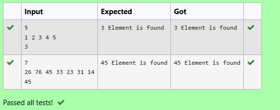

# Binary Tree Search Program in C
## Aim:
To create a binary search tree (BST) using user input and then search for a specific node in the tree. The program displays whether the searched element exists in the tree.

## Description:
Binary Search Tree (BST) is a type of binary tree where the left child contains only nodes with values lesser than the parent node, and the right child contains only nodes with values greater than the parent.

This program builds a BST and performs a search for a given key.

### Input:
The first input is the number of nodes to insert.

The next n integers are the values of the nodes.

The last input is the value to search in the BST.

### Output:
If the element exists in the tree: 45 Element is found

If the element does not exist: Not Found

## Program Code:
```
#include <stdio.h>
#include <string.h>
#include <math.h>
#include <stdlib.h>

struct node {
    
    int data;
    struct node *left;
    struct node *right;
  
};

struct node* insert( struct node* root, int data ) {
		
	if(root == NULL) {
	
        struct node* node = (struct node*)malloc(sizeof(struct node));

        node->data = data;

        node->left = NULL;
        node->right = NULL;
        return node;
	  
	} else {
      
		struct node* cur;
		
		if(data <= root->data) {
            cur = insert(root->left, data);
            root->left = cur;
		} else {
            cur = insert(root->right, data);
            root->right = cur;
		}
	
		return root;
	}
}

/* you only have to complete the function given below.  
node is defined as  

struct node {
    
    int data;
    struct node *left;
    struct node *right;
  
};

*/
void display(struct node *root) {
     if (root == NULL)  
        return;  
    display(root->left);
    printf("%d ", root->data);
    display(root->right); 
}
struct node* search(struct node *root, int value) { // just this function needs to be filled .. meaw
  //type your code here
  if (root == NULL) {
        printf("Not Found\n");
        return NULL;
    }

    if (root->data == value) {
        printf("%d Element is found\n",value);
        return root;
    }

    if (value < root->data)
        return search(root->left, value);
    else
        return search(root->right, value);
}
int main() 
{
    struct node* root = NULL;
    //struct node* y;
    
    int t,x;
    int data,choice=2;

    scanf("%d", &t);

    while(t-- > 0) 
    {
        scanf("%d", &data);
        root = insert(root, data);
    }
//    printf("\n Enter choice:1-display 2-delete\n");
    scanf("%d",&x);
    switch(choice)
    {
    case 1:
	display(root);
	break;
	case 2:
	search(root,x);
	break;
    }
    return 0;
}

```
## Output:

## Conclusion:
Successfully implemented a Binary Search Tree in C.

The program inserts values and efficiently searches for a node using recursion.

Demonstrates the power and simplicity of BSTs in search operations.